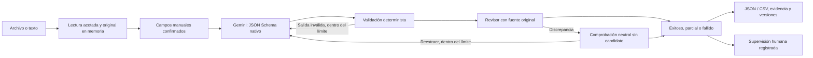

# Arquitectura y decisiones

La aplicación utiliza React + TypeScript para la interfaz y una API FastAPI local. El pipeline no depende de la interfaz: recibe documentos, un esquema y proveedores con contratos explícitos. Los ejemplos de contratos se mantienen fuera del runtime; no hay campos de pagos, plantillas por dominio ni rutas de Edifica en la aplicación.

El diagrama describe posibilidades; la interfaz sólo marca etapas que realmente ejecutó el backend. Si Gemini rechaza la solicitud antes de responder, validación y revisor permanecen «No ejecutado».

| Módulo | Responsabilidad |
|---|---|
| `inputs.py` | Firmas y límites de archivos, lectura TXT/DOCX/PDF, fuente multimodal original y hash. |
| `schema.py` | Contratos Pydantic de campos, revisiones, versiones, eventos, llamadas y reportes. |
| `providers.py` | Gemini REST, cabecera de credencial, salida estructurada nativa, errores sanitizados y tokens. |
| `validation.py` | JSON estricto, tipos, restricciones, ausencias y comparación con una referencia declarada. |
| `reviewer.py` | Contextos nuevos, cobertura de campos, evidencia y comprobación neutral independiente. |
| `pipeline.py` | Hasta tres intentos y seis revisiones; aislamiento de fallos y registro de cada llamada. |
| `reports.py` | Exportación JSON/CSV, sin fórmulas ejecutables y con trazabilidad. |
| `sessions.py` | Sesiones efímeras, locks, originales privados, retención y cuotas de memoria. |
| `server.py` | API local, Host/Origin/CSRF, lotes en segundo plano, eventos y supervisión humana. |
| `launcher.py` | Entorno Windows, dependencias fijadas, compilación y reutilización de instancia. |
| `web/src` | Componentes de documentos, campos, resultados, flujo, tokens y configuración. |

## Validación y revisión

La salida nativa de Gemini recibe `responseMimeType: application/json` y `responseJsonSchema`, conforme a la [documentación oficial](https://ai.google.dev/gemini-api/docs/generate-content/structured-output). La validación local conserva las restricciones aunque el adaptador de esquema sólo envíe el subconjunto soportado por el proveedor. No se confía en el texto del modelo para decidir si su JSON es válido.

Los campos obligatorios pueden ser `null` en el contrato técnico para representar ausencia honestamente. La regla de negocio los clasifica después. Los campos opcionales ausentes no impiden éxito si la ausencia se contrasta con la fuente. El producto aplica reglas genéricas declaradas (tipo, fecha, enum, mínimo/máximo), sin introducir validadores de contratos o pagos que no necesite el usuario.

Extractor y revisor utilizan modelos configurables distintos por defecto, `gemini-3.5-flash-lite` y `gemini-3.8-flash`, comprobados en la [lista oficial](https://ai.google.dev/gemini-api/docs/models) y disponibles en la consulta autenticada de la clave. Ambos usan Gemini: independencia significa contexto y tarea separados, no independencia entre proveedores ni una garantía de verdad.

Una revisión debe cubrir cada campo exactamente una vez. Las citas de una fuente textual se contrastan literalmente tras normalizar espacios. Una nueva comprobación sólo recibe preguntas neutrales y el original, sin los valores propuestos. Si se reextrae, se conserva el candidato anterior y la nueva versión. La verificación literal tiene límites en imágenes/PDF sin texto extraíble; la relación semántica entre dato y evidencia sigue dependiendo del modelo.

## Estado, consumo y reportes

El servidor ejecuta un lote por sesión en un hilo y publica eventos reales. La interfaz consulta cada 700 ms durante el análisis. Una sesión inactiva o una clave borrada impide nuevas solicitudes; una ya enviada puede finalizar. No hay reintentos implícitos en el cliente REST.

Cada llamada registra consumo informado, incluidos errores con metadatos. El total completo sólo existe si todos los conteos están disponibles; la UI puede mostrar un mínimo conocido con «≥». Solicitudes no enviadas se distinguen de solicitudes fallidas. La estimación de entrada no se suma al consumo real.

El reporte separa modos `gemini` y `test_injected`. La procedencia real/sintética se declara explícitamente en los documentos; la ausencia de esa declaración se cuenta como `undeclared_documents`. Subir un archivo o usar Gemini no prueba su origen. La exactitud requiere una referencia identificada y una declaración de revisión independiente, separada de éxito operativo.

La supervisión bajo 70% es una política local documentada, no un umbral del curso ni confianza del modelo. Las revisiones humanas se validan, se exportan y conservan el resultado automático para que la tasa no se eleve artificialmente.

## Seguridad y operación

El servidor usa `127.0.0.1:8765`, cookie HttpOnly/SameSite, controles estrictos Host/Origin y CSRF, CSP y respuestas sin caché. La clave no se devuelve en las APIs, no entra en URLs ni se registra. Se impiden redirecciones del cliente de Gemini. Los originales se leen en memoria con tamaños acotados; no se extraen ZIP al disco ni se ejecuta contenido documental.

El lock Python fija versiones verificadas; `package-lock.json` fija frontend. Los marcadores de hash sólo evitan reinstalaciones y compilaciones innecesarias, no certifican integridad criptográfica de las distribuciones. Pruebas y límites residuales se explican en [SECURITY_REVIEW.md](docs/SECURITY_REVIEW.md).
